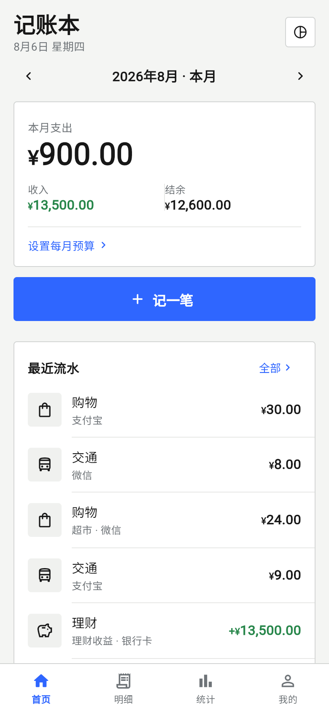
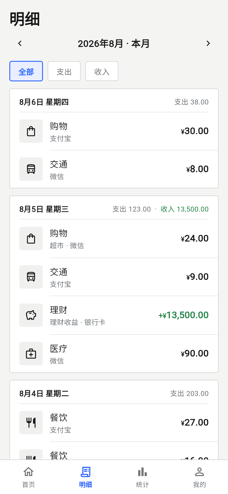
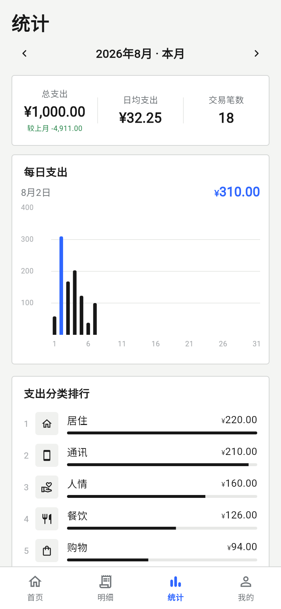
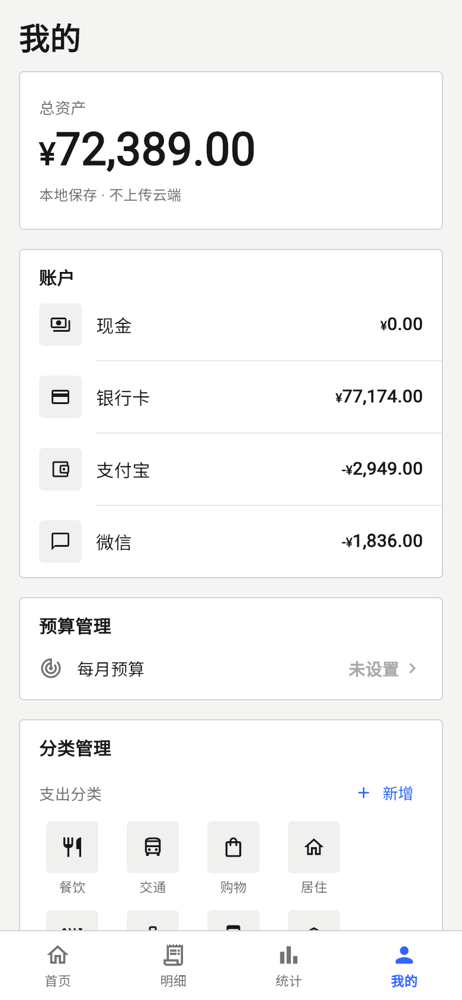

# 记账本（MoneyThings Goal）

一款**本地记账**手机 App，基于 Flutter 开发。设计遵循「精密编辑财务 UI」规范：暖灰页面、白色纸面数据组、黑色编辑层级、细分隔线、单一蓝色强调、零阴影、无彩虹分类色。

## 功能

- 🏠 **首页**：本月支出/收入/结余、预算进度、最近流水、支出分类排行
- 📋 **明细**：按月分组流水、收支筛选、**按备注/分类搜索**
- 📊 **统计**：总支出/日均/笔数、每日支出柱状图、**结余走势（近 6 月）**、支出/收入分类排行、环比
- 👤 **我的**：总资产、账户（可设**初始余额**）、预算管理、**自定义分类**、数据导入导出、关于
- ✍️ **记一笔**：金额/分类/日期/账户/备注，支出收入切换，预算超额提醒
- 🔒 **本地保存**：数据只存在设备上（SharedPreferences），不上传云端
- 📤/📥 **CSV 导入导出**：Excel 可直接打开中文，导入自动去重
- 🎨 **应用图标**：黑底白¥ + 蓝色强调线（Android/iOS 自适应图标）
- 🚀 **首启引导**：3 页介绍 + 开始使用

## 截图

| 首页 | 明细 | 统计 | 我的 |
|---|---|---|---|
|  |  |  |  |

## 技术栈

- Flutter 3.44 / Dart 3.12
- 状态：provider（ChangeNotifier）
- 存储：shared_preferences（JSON，金额以「分」存储避免浮点误差）
- 图表：fl_chart
- 分享/路径：share_plus / path_provider
- 图标：flutter_launcher_icons

## 构建

```bash
flutter pub get
flutter run              # 连设备/模拟器运行
flutter test             # 19 个单元+组件测试
flutter build apk --release   # release APK（签名见下）
```

### Release 签名

- 签名密钥：`android/upload-keystore.jks`（**不入库**，本地保留）
- 配置：`android/keystore.properties`（**不入库**）
- 缺失配置时 release 自动回退 debug 签名

## 目录结构

```
lib/
├── main.dart               # 入口 + 底部导航外壳
├── theme/                  # 设计令牌与主题
├── models/                 # 交易/分类/账户模型、图标集
├── data/                   # SharedPreferences 持久化 + AppState
├── services/               # CSV 导出/导入
├── widgets/                # 共享组件（纸面组/流水行/月份选择等）
└── pages/                  # 首页/明细/统计/我的/记一笔/引导
```

## 版本历史

- v3.1：明细多选批量删除 · 版本号 3.0.0
- v3.0：本月小结 · JSON 备份文件分享
- v1.0：四大页面、记一笔、本地持久化、统计图表、示例数据
- v1.1：CSV 导出、预算超额提醒、统计环比、应用图标
- v1.2：自定义分类、收入排行、release 签名
- v1.3：明细搜索、月份快速跳转、CSV 导入
- v1.4：账户初始余额、结余走势、首启引导、文档

## 设计原则

- 视觉遵循「精密编辑财务 UI」：暖灰页面、白色纸面数据组、黑色编辑层级、细分隔线、单一蓝色强调、零阴影。
- **关于深色模式**：暖灰浅色是应用的核心品牌规范，为保证图表与金额的对比与可读性，当前版本不提供深色模式；如需支持系统深色主题，需整体重设计深色令牌（建议作为独立版本评估）。

## 隐私

所有数据仅保存在设备本地，详见 [PRIVACY.md](PRIVACY.md)。
